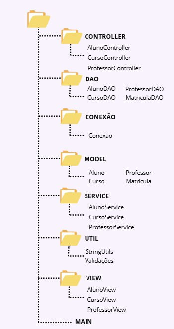

= 📚 Marketplace de Cursos Online

:icons: font
:toc: left
:toclevels: 2

== 📝 Descrição
A NebulaPro é uma plataforma que oferece cursos online para alunos em diversas áreas de conhecimento, como tecnologia, design, negócios e idiomas. O objetivo da empresa é criar um espaço em que os instrutores possam oferecer seus cursos e os alunos possam se inscrever, aprender e obter certificação. Atualmente, a empresa opera manualmente e não possui uma plataforma centralizada, o que gera problemas de organização, falta de visibilidade sobre os alunos e dificuldade na gestão dos cursos.

== 🎯 Problema
A NebulaPro deseja criar um marketplace online de cursos onde instrutores possam cadastrar seus cursos, gerenciar as turmas e interagir com os alunos. Ao mesmo tempo, os alunos devem ser capazes de buscar cursos, se inscrever e acompanhar seu progresso. A empresa também precisa de um controle robusto para gerenciar os pagamentos, os certificados dos alunos e a avaliação da qualidade dos cursos.

== ⚙️ Funcionalidades Mínimas

* Separação de responsabilidades: camadas Model, DAO, Service e View/Menu
* Persistência de dados com JDBC (MySQL)
* Padrões de projeto: DAO para acesso a dados, Singleton para conexão com banco
* Sistema de matrícula, avaliação
* Estrutura preparada para integração com APIs de pagamento e autenticação de usuários

== 🗂️ Requisitos Funcionais
**1️⃣ Cadastro de Aluno**

*  O sistema deve permitir o cadastro de um aluno.

*  Dados necessários: 
          ** id
          ** nome
          ** CPF
          ** email
          ** idade
          ** cursoDesejado
          ** datatEntrada

*  O CPF deve ser único no sistema.

**2️⃣ Cadastro de Professor**

* O sistema deve permitir o cadastro de um professor.

* Dados necessários: 
           ** id
           ** nome
           ** cpf
           ** email
           ** idade
           ** formação acadêmica

**3️⃣ Cadastro de Curso**

*   O sistema deve permitir que um curso seja cadastrado.

*   Dados necessários: 
          ** Id 
          ** Nome
          ** IdProfessor
          ** CargaHoraria
          ** Status (INICIANDO, EM_ANDAMENTO, CONCLUÍDA)
          ** Descrição

**4️⃣ Matrícula de Aluno em Curso**

* O sistema deve permitir que um aluno se matricule em um curso, gerando uma “nota” mostrando que está matriculado.

**5️⃣ Listagem de Alunos**

* O sistema deve permitir a listagem de todos os alunos cadastrados.

**6️⃣ Listagem de Professores**

* O sistema deve permitir a listagem de todos os professores cadastrados.

**7️⃣ Listagem de Cursos**

* O sistema deve permitir a listagem de todos os cursos cadastrados.

**8️⃣ Associação de Professor a Curso**

* O sistema deve permitir a associação de um professor a um curso.

* O professor deve ser associado apenas a um curso, de acordo com sua disponibilidade.

**9️⃣ Cancelamento de Matrícula**

* O sistema deve permitir que um aluno cancele sua matrícula em um curso.

== 🔐 Requisitos não Funcionais

** 🧠 Desempenho 

* O sistema deve responder às consultas (ex: listagem de cursos) em até 2 segundos.

* As operações de cadastro e matrícula devem ser concluídas em no máximo 3 segundos.

** 🔒 Segurança 

* O sistema deve validar todas as entradas para evitar injeções SQL.

* As senhas dos usuários devem ser armazenadas de forma segura (ex: com hash).

** ⚙️ Confiabilidade 

* O sistema deve manter os dados consistentes mesmo em caso de falhas.

* Deve haver tratamento de erros com mensagens amigáveis para o usuário.

** 🧩 Manutenibilidade 

* O código deve seguir a organização em camadas (Model, DAO, Service, View).

* O uso de padrões de projeto (DAO, Singleton) deve ser aplicado corretamente.

** 💻 Usabilidade 

* A interface deve ser simples e intuitiva para alunos e professores.

* As mensagens exibidas devem ser claras e fáceis de entender.

** 🔄 Portabilidade 

* O sistema deve ser compatível com Java 17+ e MySQL 8+.

* Deve funcionar em diferentes sistemas operacionais (Windows, Linux, MacOS).

** 🚀 Escalabilidade (para futuras versões) 

* A arquitetura deve permitir a integração futura com API REST.

* O sistema deve estar preparado para integração com APIs de pagamento e autenticação.

== 🏡 Modelagem Arquitetural
**Diagrama de Classe**

== ⚙️ Passo a passo para rodar o projeto

* 1️⃣ Clone o repositório
Abra o terminal e execute:

 git clone https://github.com/HellenGabi/MarketplaceDeCursoOnline.git

* Depois entre na pasta do projeto:

 cd MarketplaceDeCursoOnline

== 🛠️ Tecnologias Utilizadas

* Java

* JDBC

* MySQL

* Padrão DAO / MVC

* API REST (em versões futuras)

== 🚀 Futuras Expansões

* Integração com API de pagamento

* Autenticação com controle de acesso (aluno, professor, admin)

* Dashboard administrativo com gráficos e KPIs

== 🫱🏾‍🫲🏿 Integrantes do Projeto
Nosso grupo é composto por: 

*  **Hellen Gabriela Scarantti**
https://github.com/HellenGabi

*  **Vitor Eduardo Eleoterio**
https://github.com/SGA-OKC

